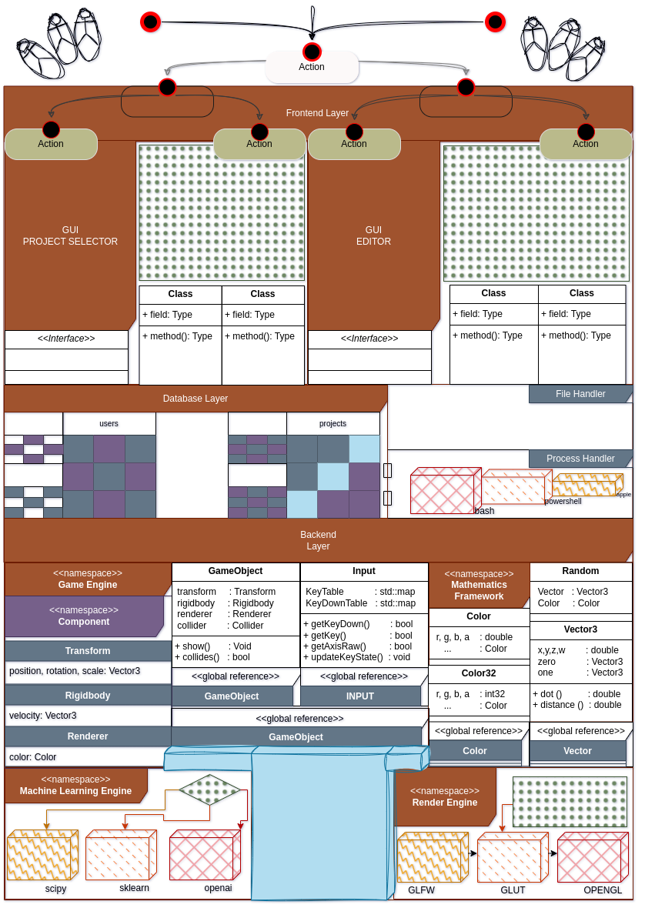
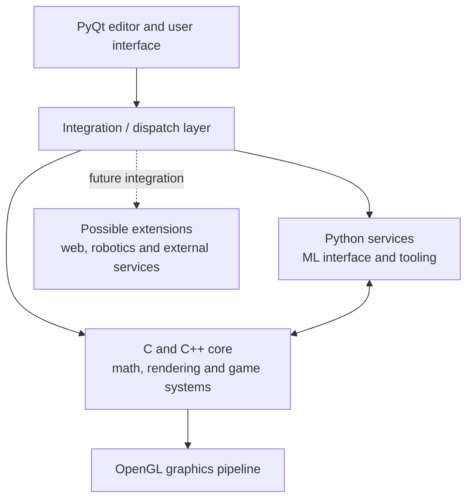
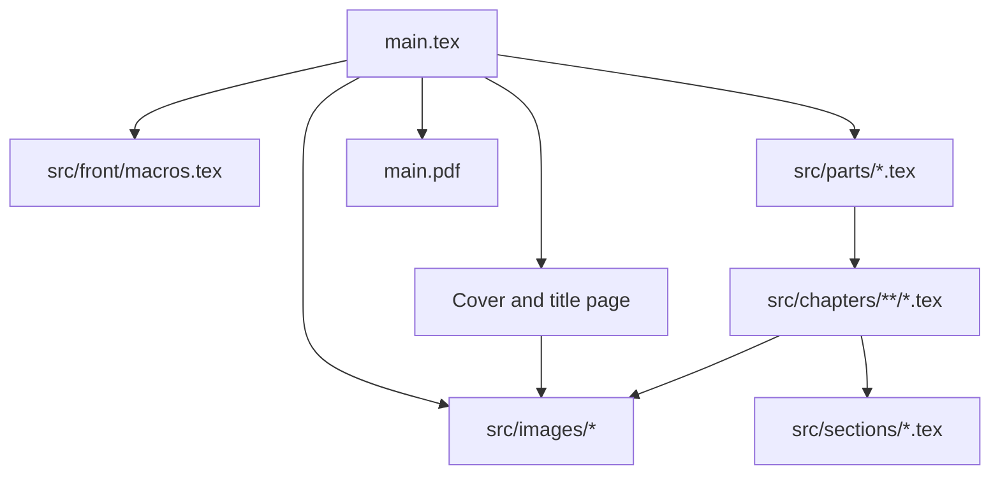

# Machine-Learning-Compatible Game Engine — Thesis Source

**LaTeX source for a 2024 Computer Science bachelor’s thesis exploring an extensible graphics framework built around C/C++, OpenGL, vector mathematics, Python tooling and machine-learning integration.**

<p align="center">
  
</p>

<p align="center">
  
  
  
  
  
</p>

## Repository purpose

This repository stores the source material, figures and generated LaTeX artefacts for an academic report. It is **not the runnable game-engine implementation itself**. The report documents the motivation, architectural direction, field study, implementation components and results of a proposed graphics and software-making framework.

The source currently uses the thesis title **OpenGL Framework**, while the repository name reflects the wider long-term concept: a game-development environment whose rendering, mathematics, editor and machine-learning components can be connected without forcing every experiment into one language or process.

## Concept described by the thesis

The proposed system is organised as a collection of interoperable layers:



The thesis discusses or proposes:

- a vector-mathematics layer;
- an OpenGL rendering framework;
- game-object management;
- a PyQt-based graphical editor;
- Python as an integration surface for machine-learning libraries and services;
- separation between native rendering code and higher-level experimentation;
- future integration with web, robotics and other external systems.

The current abstract describes a user-facing OpenGL interface for experimenting with vector operations, graphics primitives and game objects. Several commented sections preserve earlier or broader ideas around GPT-assisted and machine-learning-aware game development.

## What is contained here

```text
Machine-Learning-Compatible-Game-Engine.pdf/
├── main.tex                  # Root LaTeX document
├── src/
│   ├── front/                # Macros, cover and title pages
│   ├── parts/                # High-level report parts
│   ├── chapters/
│   │   ├── academic/         # Motivation, goals and benefits
│   │   ├── app/              # Application overview and architecture
│   │   ├── research/         # Field-study and research material
│   │   └── old/              # Retained earlier drafts
│   ├── sections/             # Focused implementation sections
│   └── images/               # Diagrams and report illustrations
├── main.aux                  # Generated LaTeX build artefact
├── main.fdb_latexmk          # Generated latexmk state
├── main.fls                  # Generated file list
├── main.log                  # Generated compiler log
└── README.md
```

The root document currently includes these principal parts:

1. Abstract.
2. Overview.
3. Field study.
4. Implementation overview.
5. Results.
6. Bibliography.

## Build the PDF

### Recommended: `latexmk`

Install a reasonably complete TeX distribution:

- **Ubuntu / Debian / WSL:** TeX Live;
- **Windows:** MiKTeX or TeX Live;
- **macOS:** MacTeX.

On Ubuntu or WSL, the required packages can usually be covered with:

```bash
sudo apt update
sudo apt install latexmk texlive-latex-extra texlive-fonts-recommended texlive-lang-european
```

Clone and enter the repository:

```bash
git clone https://github.com/dragosandreibobu/Machine-Learning-Compatible-Game-Engine.pdf.git
cd Machine-Learning-Compatible-Game-Engine.pdf
```

Compile:

```bash
latexmk -pdf main.tex
```

The generated document will be:

```text
main.pdf
```

Clean generated intermediate files:

```bash
latexmk -c
```

Remove the generated PDF as well:

```bash
latexmk -C
```

### Manual `pdflatex` workflow

The report uses a table of contents and internal references, so more than one compiler pass may be required:

```bash
pdflatex main.tex
pdflatex main.tex
```

Run another pass when LaTeX reports unresolved references or an outdated table of contents.

## LaTeX dependencies

The root document currently imports:

| Package | Purpose |
|---|---|
| `geometry` | A4 page margins |
| `inputenc` | UTF-8 source encoding |
| `palatino` | Palatino-style document typography |
| `babel` | Language handling |
| `graphicx` | Embedded diagrams and images |
| `indentfirst` | First-paragraph indentation |
| `tocbibind` | Table-of-contents integration |
| `hyperref` | Clickable references and contents |
| `wrapfig` | Wrapped illustrations |
| `sidecap` | Side captions |
| `amsmath` | Mathematical notation |
| `xcolor` | Coloured architecture/status text |
| `listings` | Syntax-highlighted C++ snippets |

Images are resolved relative to:

```latex
\graphicspath{{src/images/}}
```

Compile from the repository root so those paths remain valid.

## Editing the document

### Change thesis metadata

General document metadata is centralised in:

```text
src/front/macros.tex
```

The macros define the institution, faculty, document title, author display name, academic session and coordinator. Review this file before generating a public PDF.

> **Privacy warning:** front-matter source should contain only the minimum information required for the document. Do not commit addresses, national identification numbers, private phone numbers or other unnecessary personal identifiers. Removing them from the latest file does not remove them from earlier Git history; exposed personal data requires history rewriting or repository replacement.

### Change the included structure

Edit `main.tex` to add, remove or reorder parts. Content is included with `\input{...}` calls, for example:

```latex
\input{src/parts/Overview.tex}
\input{src/parts/Implementation.tex}
```

### Add a chapter or section

1. Create a `.tex` file under the relevant `src/` directory.
2. Add an `\input{...}` statement from a parent part or from `main.tex`.
3. Rebuild with `latexmk -pdf main.tex`.

### Add an image

Place the asset in `src/images/` and reference it without repeating the directory prefix:

```latex
\includegraphics[width=\textwidth]{example.png}
```

Use descriptive captions and ensure the image can still be understood when printed in greyscale.

### Add source-code listings

The document configures the `listings` package for C++:

```latex
\begin{lstlisting}[caption={Example rendering code}]
// code here
\end{lstlisting}
```

## Document architecture



## Reading guide

For someone evaluating the project rather than editing LaTeX:

1. Start with the abstract for the intended user-facing system.
2. Read the academic overview for the problem framing and goals.
3. Review the field study for the technology landscape considered.
4. Use the implementation architecture to understand the relationship between PyQt, Python and the C/C++ core.
5. Read the focused sections on the mathematics engine, rendering engine, machine-learning interface and PyQt frontend.
6. Treat commented and `old/` material as historical drafting context, not as final claims.

## Current state and interpretation

This repository should be read as an **academic design and documentation artefact**. It captures a broad framework vision and parts of its implementation rationale, but it does not provide one packaged executable that implements every component shown in the architecture diagram.

The source also preserves drafting traces:

- commented planning prompts;
- abandoned or superseded chapter versions;
- a mixture of polished prose and working notes;
- generated LaTeX build files committed alongside source;
- terminology that alternates between “OpenGL Framework” and the wider machine-learning-compatible engine concept.

Those characteristics are useful for historical context but should be cleaned before presenting the report as a polished publication.

## Recommended repository improvements

1. Remove unnecessary personal data and purge it from Git history.
2. Decide on one canonical public title and explain its relation to the broader engine project.
3. Keep only source files and intentionally published PDFs under version control.
4. Add a `.gitignore` for LaTeX intermediates.
5. Move unused drafts into a clearly labelled archive or separate branch.
6. Finish or remove commented placeholder text in the abstract and chapters.
7. Add a reproducible CI build that publishes the PDF as an artefact.
8. Add citations through BibTeX or `biblatex` instead of maintaining bibliography content manually where practical.
9. Add links to the corresponding implementation repositories.
10. Export selected diagrams at web-friendly sizes for easier review on GitHub.

Suggested `.gitignore` entries:

```gitignore
*.aux
*.fdb_latexmk
*.fls
*.log
*.out
*.toc
*.synctex.gz
```

Whether `main.pdf` should be ignored depends on whether this repository is intended to publish the compiled thesis or only its source.

## Relationship to implementation repositories

The thesis describes a suite rather than a single monolithic program. Related experiments and implementations may live under the **Machine-Learning-Compatible-Game-Engine** GitHub organisation. Their documentation should identify which architectural component they implement instead of claiming that every repository is the complete engine.

## Academic context

- Institution: Alexandru Ioan Cuza University of Iași, Faculty of Computer Science.
- Document type: bachelor’s thesis source.
- Academic session: 2024.
- Primary themes: computer graphics, OpenGL abstraction, vector mathematics, editor tooling and machine-learning integration.

## License

No explicit licence is currently included. Unless a licence is added, the source text, diagrams and other repository contents remain under the copyright holder’s default rights.
